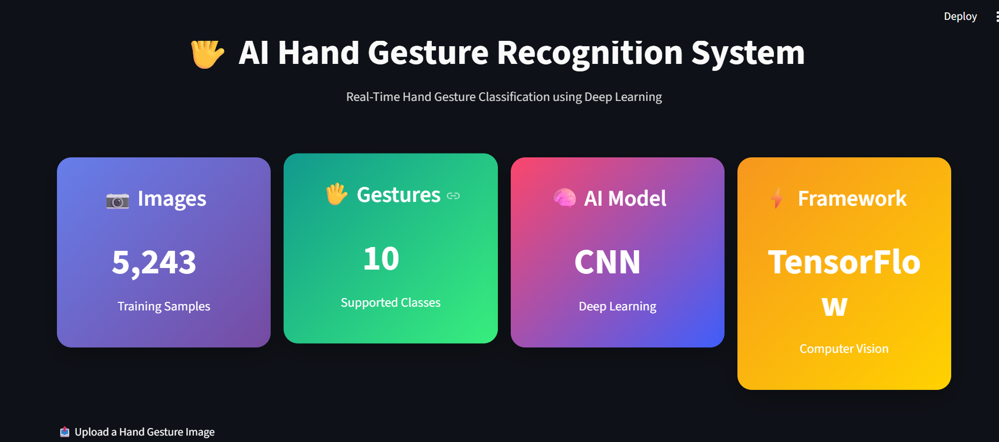
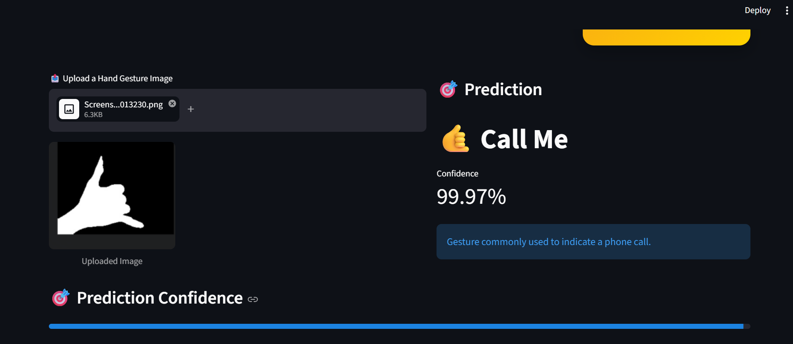
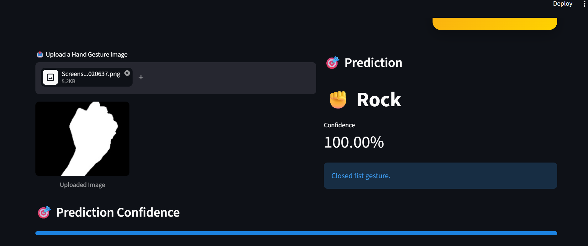
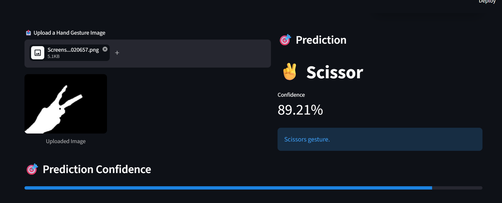

# 🤖 AI Hand Gesture Recognition using CNN

A deep learning-based Hand Gesture Recognition system built using **TensorFlow, Keras, OpenCV, and Streamlit**. The model classifies hand gesture images into **10 different gesture classes**, enabling intuitive human-computer interaction through gesture recognition.

---

## 📌 Project Overview

This project uses a Convolutional Neural Network (CNN) to recognize hand gestures from images. The trained model is integrated into an interactive Streamlit web application where users can upload an image and receive the predicted gesture along with the model's confidence score.

## 🎥 Demo

The application allows users to upload a hand gesture image and predicts the corresponding gesture class with a confidence score through an interactive Streamlit interface.

## 🎥 Live Demo

🔗 [https://your-streamlit-app.streamlit.app](https://sctml04-vnbtg4cjornrcjh3yapyjd.streamlit.app/)

---

## ✨ Features

- 🖐 Recognizes **10 different hand gestures**
- 🧠 Custom CNN model built with TensorFlow/Keras
- 📷 Upload and classify hand gesture images
- 📊 Displays prediction confidence
- 🌐 Interactive Streamlit web interface
- ⚡ Fast image preprocessing using OpenCV

---

## 🗂 Dataset

- **Total Images:** 5,243
- **Gesture Classes:** 10
- **Image Size:** 128 × 128 pixels

### Gesture Classes

- 🤙 Call Me
- 🤞 Fingers Crossed
- 👌 Okay
- ✋ Paper
- ✌ Peace
- ✊ Rock
- 🤘 Rock On
- ✂️ Scissor
- 👍 Thumbs Up
- ☝ Point Up

---

## 🧠 Model Architecture

The model was built using a custom Convolutional Neural Network (CNN) consisting of:

- Convolution Layers
- Max Pooling Layers
- Batch Normalization
- Dropout Layers
- Dense Layers
- Softmax Output Layer

---

## 🛠 Tech Stack

- Python
- TensorFlow / Keras
- OpenCV
- NumPy
- Scikit-learn
- Matplotlib
- Streamlit
- Pillow

---

## 📁 Project Structure

```text
SCT_ML_04/
│
├── app.py
├── Hand_Gesture_Recognition.ipynb
├── requirements.txt
├── README.md
├── .gitignore
│
├── dataset/
│
├── model/
│   ├── gesture_model.keras
│   └── label_encoder.pkl
│
└── screenshots/
```

---

## 🚀 Installation

### Clone Repository

```bash
git clone https://github.com/rashmideepaktoragallamath/SCT_ML_04.git
```

### Move into Project Folder

```bash
cd SCT_ML_04
```

### Install Dependencies

```bash
pip install -r requirements.txt
```

### Run the Application

```bash
streamlit run app.py
```

---

## 📸 Application Preview

### Home Page



### Prediction Example






---

## 📈 Future Improvements

- Real-time webcam gesture recognition
- Data augmentation for better generalization
- Transfer Learning (MobileNetV2 / EfficientNet)
- Improved UI/UX
- Support for additional gesture classes

---

## 👩‍💻 Author

**Rashmi Deepak Toragallamath**

- GitHub: https://github.com/rashmideepaktoragallamath

---

⭐ If you found this project interesting, consider giving it a star on GitHub!
